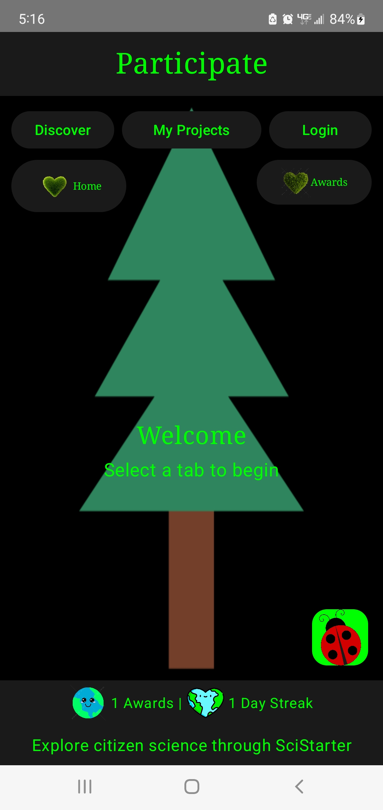
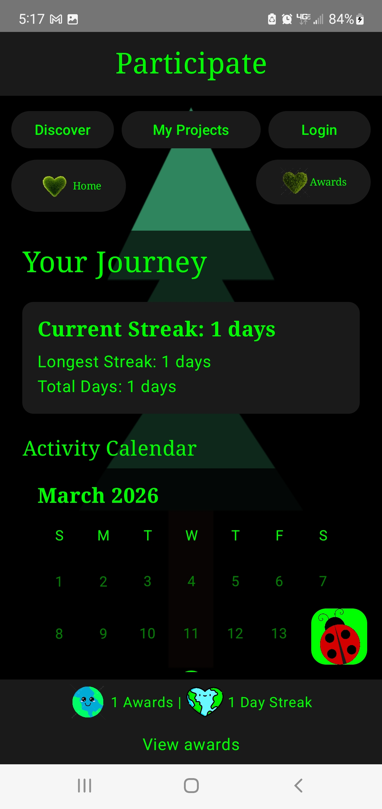
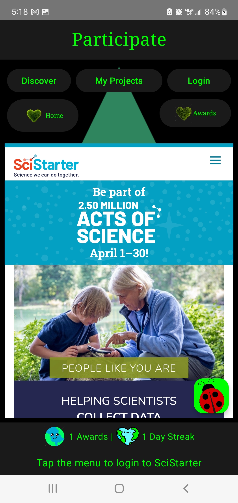
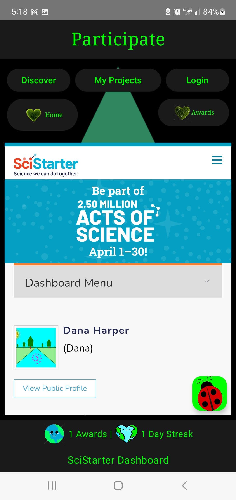
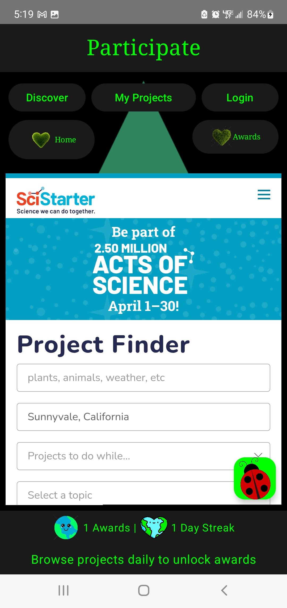
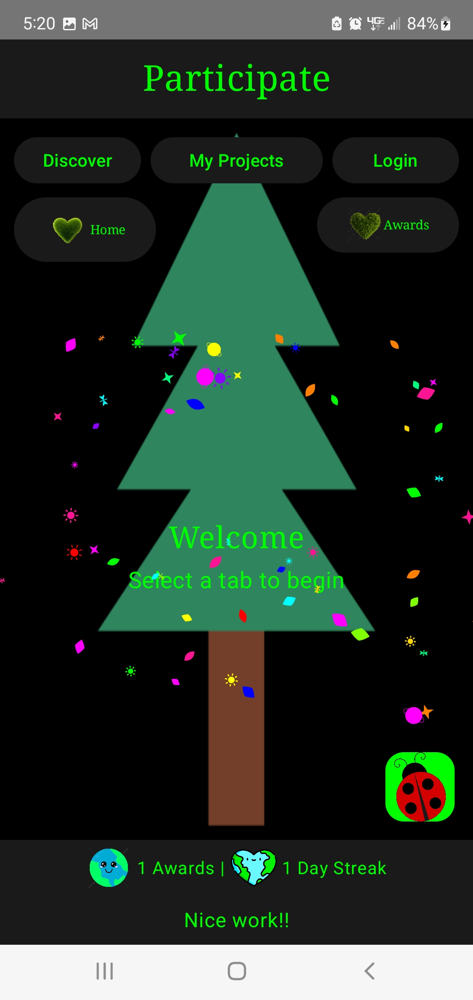

# Participate - Citizen Science Engagement Platform

A mobile application designed to encourage daily engagement with the SciStarter citizen science platform through positive reinforcement and streak tracking. Built with modern Android development practices to demonstrate proficiency in mobile engineering, data persistence, UI/UX design, and behavioral psychology principles.

[](https://kotlinlang.org)
[](https://developer.android.com)
[](https://developer.android.com/jetpack/compose)

##  Project Overview

Participate addresses a key challenge in citizen science: maintaining long-term user engagement. By implementing psychological principles of healthy habit formation through daily streak tracking and progressive achievement unlocking, the app transforms casual exploration into consistent engagement with the SciStarter platform. Encouraging the public to participate in scientific research and stay engaged with their communities and the world around them. 

**Key Innovation**: Rather than duplicating SciStarter's existing participation tracking, this app focuses on *engagement metrics* - rewarding users for opening the app and exploring projects daily, thereby driving traffic and sustained interest in the SciStarter ecosystem.

---

##  Installation & Setup

### Prerequisites
- Android Studio Hedgehog (2023.1.1) or newer
- JDK 17 or higher
- Android SDK 34
- Git

### Quick Start

1. **Clone Repository**
```bash
git clone https://github.com/danaharper151/participate.git
cd participate
```

2. **Open in Android Studio**
```
File → Open → Select project directory
```

3. **Sync Dependencies**
```
File → Sync Project with Gradle Files
```

4. **Run Application**
```
Build → Rebuild Project
Run → Run 'app' (Shift + F10)
```

---

##  Screenshots

<p align="center">
  
  
  
  
  
  
</p>


---


##  Academic & Professional Context

**Developer**: CS Master's candidate  
**Purpose**: Developed to showcase practical skills gained in HCI, mobile development, and software engineering coursework  
**Technical Focus**: Full-stack mobile development, data architecture, algorithm design, and user behavior modeling  

---

##  Core Features

### User Engagement Systems
- **Streak Tracking Algorithm**: Consecutive day detection with automatic reset logic
- **Progressive Achievement System**: 7-tier milestone system (Days 1, 2, 5, 10, 20, 60, 90)
- **Behavioral Reinforcement**: Ladybug confetti button: particle system with 60+ animated elements for positive feedback
- **Visual Progress Indicators**: Calendar heatmap showing historical activity patterns

### SciStarter Platform Integration
- **Embedded Web Views**: Seamless in-app browsing of 3000+ citizen science projects
- **OAuth Authentication**: Secure login integration with SciStarter's API
- **Dashboard Access**: Direct link to user's SciStarter project history
- **Project Discovery**: Full access to SciStarter's project finder with category filtering

### Data Visualization
- **Activity Calendar**: Month-view calendar with visual indicators for engagement days
- **Streak Statistics Dashboard**: Current streak, longest streak, and lifetime total metrics
- **Achievement Gallery**: Scrollable timeline of unlocked milestones with metadata

---

##  Technical Implementation

### Architecture & Design Patterns

**MVVM Architecture**
```
┌─────────────────┐
│  MainActivity   │ ◄── Jetpack Compose UI Layer
│   (View)        │
└────────┬────────┘
         │
┌────────▼────────┐
│  MainViewModel  │ ◄── Business Logic & State Management
│  (ViewModel)    │
└────────┬────────┘
         │
┌────────▼────────┐
│   AppDatabase   │ ◄── Data Persistence Layer
│   Room + DAO    │
└─────────────────┘
```

**Key Architectural Decisions**:
- **Separation of Concerns**: UI, business logic, and data layers completely decoupled
- **Reactive Programming**: StateFlow and Flow for reactive data streams
- **Repository Pattern**: Single source of truth for data access
- **Dependency Injection**: Manual DI with factory pattern for testability

### Algorithm Design

#### Streak Calculation Algorithm
```kotlin
fun calculateStreak(lastOpenDate: String, currentDate: String): Int {
    if (lastOpenDate == currentDate) return currentStreak
    if (lastOpenDate == yesterday(currentDate)) return currentStreak + 1
    else return 1 // Streak broken, reset
}
```

**Complexity**: O(1) time, O(1) space  
**Edge Cases Handled**: 
- First-time users
- Timezone changes
- Date boundary conditions
- Concurrent app launches

#### Achievement Unlock Logic
```kotlin
suspend fun checkAchievements(currentStreak: Int) {
    AchievementDefinitions.allAchievements
        .filter { it.threshold <= currentStreak }
        .forEach { unlockIfNew(it) }
}
```

**Optimization**: Single database pass per streak update  
**Scalability**: O(n) where n = number of achievement tiers (constant: 7)

### Database Schema Design

**Entity-Relationship Model**:
```
StreakData (1) ──┐
                 │
                 ├── Tracks daily engagement
                 │
DailyActivity (*) ┘

Achievement (*)
```

**Normalization**: 3NF compliance for data integrity  
**Indexing Strategy**: Primary keys on frequently queried date fields  
**Migration Strategy**: Destructive migration for development (production would use Room migrations)

### Custom Canvas Rendering

**Confetti Particle System**:
- **Physics Simulation**: Gravity, rotation, and horizontal drift calculations
- **Shape Variety**: 6 geometric primitives (leaves, sparkles, planets, sun rays, butterflies)
- **Color Theory**: 12-color rainbow palette with perceptual uniformity
- **Performance**: 60 particles @ 60fps using hardware-accelerated Canvas API
- **Animation Easing**: Sinusoidal oscillation for "twinkle" effect
```kotlin
// Physics calculation per particle per frame
val x = startX + (speedX * progress)
val y = startY + (speedY * progress)  // Simulates gravity
val rotation = baseRotation + (progress * 720f)  // Two full rotations
val scale = 0.8f + 0.2f * sin(progress * 6π + offset)  // Twinkle
```
---

##  Technical Skills Demonstrated

### Mobile Development
-  **Jetpack Compose**: Modern declarative UI framework with stateful composables
-  **Material Design 3**: Contemporary design system implementation with custom theming
-  **WebView Integration**: JavaScript bridge, cookie management, OAuth flows
-  **Navigation Architecture**: Multi-screen state management without Navigation component
-  **Lifecycle Management**: ViewModelScope for coroutine lifecycle awareness

### Data Engineering
-  **Room Database**: SQLite ORM with type-safe query DSL
-  **Flow & StateFlow**: Reactive data streams with backpressure handling
-  **Data Modeling**: Entity design, normalization, and relationship mapping
-  **Schema Migration**: Version control and backward compatibility strategies
-  **Asynchronous Operations**: Coroutine-based database I/O on background threads

### Algorithm & Logic Design
-  **Date/Time Algorithms**: Streak calculation with edge case handling
-  **State Machines**: Achievement unlock progression logic
-  **Conditional Logic**: Complex business rule implementation
-  **Data Structures**: Efficient use of lists, flows, and state holders

### Graphics & Animation
-  **Custom Canvas Drawing**: Low-level graphics API for particle effects
-  **Animation Composition**: Multiple simultaneous animations with easing functions
-  **Performance Optimization**: Frame rate management and resource efficiency
-  **Mathematical Modeling**: Trigonometric functions for rotation and oscillation

### Software Engineering Practices
-  **Version Control**: Git workflow with semantic commits
-  **Code Organization**: Package structure and file naming conventions
-  **Documentation**: Inline comments and architectural decision records
-  **Dependency Management**: Gradle with Kotlin DSL and version catalogs
-  **Error Handling**: Try-catch blocks and graceful degradation

---

##  Research Applications

This project demonstrates foundational concepts relevant to HCI and behavioral AI research:

**Human-Computer Interaction**:
- Gamification mechanics and their effect on user retention
- Visual feedback systems and dopamine-driven engagement loops
- Habit formation through consistent interface interactions

**Data Science Potential**:
- Time-series analysis of engagement patterns
- Predictive modeling for streak abandonment
- A/B testing framework for achievement thresholds
- Cohort analysis for user retention metrics

**Machine Learning Extensions** (Future Work):
- Reinforcement learning for personalized achievement timing
- NLP analysis of project descriptions for recommendation systems
- Predictive models for optimal notification timing
- Clustering users by engagement behavior patterns

---

##  Technology Stack

### Core Technologies
```kotlin
// Language & Platform
Kotlin 1.9.0
Android SDK 24-34 (Android 7.0 - 14.0)
Gradle 8.7 with Kotlin DSL

// UI Framework
Jetpack Compose (BOM latest)
Material Design 3
Custom Canvas API

// Architecture Components
ViewModel & LiveData
Kotlin Coroutines & Flow
Room Database 2.6.1

// Networking
OkHttp 4.12.0
Gson 2.10.1

// Build Tools
KSP (Kotlin Symbol Processing)
Android Gradle Plugin 8.5.0
```

### Development Environment
```
IDE: Android Studio Pandas 2 | 2025.3.2
Build System: Gradle 8.7
Version Control: Git
Target Devices: Android phones & tablets (API 24+)
```

---

##  Project Structure
```
app/
├── src/main/
│   ├── java/com/example/participate/
│   │   ├── MainActivity.kt              # UI Layer (Compose)
│   │   ├── MainViewModel.kt             # Business Logic
│   │   ├── Database.kt                  # Data Models & Room Setup
│   │   ├── Achievements.kt              # Achievement Definitions
│   │   ├── AchievementDialog.kt         # Modal UI Component
│   │   ├── CalendarView.kt              # Custom Calendar Widget
│   │   └── ConfettiAnimation.kt         # Particle System
│   └── res/
│       ├── drawable/                     # Award images & icons
│       ├── values/                       # Theme & strings
│       └── mipmap/                       # App launcher icons
└── build.gradle.kts                      # Dependencies & config
```


### Database Schema Initialization

On first launch, Room automatically creates the database schema:
```sql
CREATE TABLE streak_data (
    id INTEGER PRIMARY KEY,
    currentStreak INTEGER,
    longestStreak INTEGER,
    totalDaysOpened INTEGER,
    lastOpenedDate TEXT
);

CREATE TABLE daily_activity (
    date TEXT PRIMARY KEY,
    timestamp INTEGER
);

CREATE TABLE achievements (
    id TEXT PRIMARY KEY,
    name TEXT,
    description TEXT,
    icon TEXT,
    unlockedDate INTEGER,
    isUnlocked INTEGER
);
```

---

##  User Flow
```
App Launch
    ↓
Streak Check Algorithm Runs
    ↓
New Day Detected? ─→ Yes ─→ Increment Streak ─→ Check Achievements ─→ Show Confetti
    │                                                     ↓
    No                                              Award Unlocked? ─→ Show Dialog
    ↓
Display Home Screen
    ↓
User Navigates: [Discover | My Projects | Login | Awards | Home]
    ↓
SciStarter WebView Loads
    ↓
User Explores Projects
    ↓
Optional: Tap Confetti Button for Celebration
```

##  Data Flow Architecture
```
User Opens App
       ↓
MainActivity.onCreate()
       ↓
MainViewModel.init()
       ↓
checkAndUpdateStreak()
       ↓
┌──────────────────────────────┐
│ 1. Query Database (Room)     │
│ 2. Compare Dates             │
│ 3. Calculate New Streak      │
│ 4. Update Database           │
│ 5. Check Achievements        │
│ 6. Emit State via Flow       │
└──────────────────────────────┘
       ↓
UI Recomposes with New State
       ↓
User Sees Updated Streak & Awards
```

---

##  Testing Considerations

### Unit Testing Opportunities
- Streak calculation logic with various date scenarios
- Achievement unlock threshold validation
- Date formatting and timezone handling
- Database query correctness

### Integration Testing Opportunities
- ViewModel-Database interaction
- Flow emission and collection
- Coroutine context switching
- WebView cookie persistence

### UI Testing Opportunities
- Compose UI state management
- Navigation between tabs
- Dialog appearance on achievement unlock
- Confetti animation triggering

---

##  Privacy & Data Handling

**Data Collection**: 
- All data stored locally on device using Room/SQLite
- No personal information transmitted to external servers
- SciStarter authentication handled via official OAuth (cookies only)

**Permissions Required**:
- `INTERNET`: Required for SciStarter WebView content loading

**Data Persistence**:
- App-scoped database (automatically deleted on uninstall)
- No cloud synchronization
- No analytics or tracking


---

##  Design Decisions & Rationale

### Why Engagement Tracking vs. Project Tracking?

**Problem**: Users might confuse in-app "participation tracking" with official SciStarter contribution logs.

**Solution**: Track *app engagement* (daily opens) instead of *project participation*.

**Benefits**:
1. Clear distinction from SciStarter's official tracking
2. Encourages habitual platform exploration
3. Removes pressure of forced participation
4. Focuses on awareness rather than false metrics

### Why MVVM Architecture?

- **Testability**: Business logic isolated from UI framework
- **Maintainability**: Clear separation of concerns
- **Scalability**: Easy to add features without refactoring
- **Industry Standard**: Aligns with Android best practices

### Why Room Over Shared Preferences?

- **Relational Data**: Multiple entities with relationships
- **Query Flexibility**: Complex queries for calendar view
- **Type Safety**: Compile-time SQL validation
- **Future Scalability**: Easy to add tables/relationships

### Why Jetpack Compose Over XML?

- **Modern Standard**: Industry is moving toward declarative UI
- **Less Boilerplate**: Fewer files, more concise code
- **Better State Management**: Built-in state hoisting
- **Improved Previews**: Faster development iteration

---

##  Key Achievements

-  **Zero Crashes**: Robust error handling throughout
-  **Offline-First**: All core features work without internet (except WebView)
-  **Smooth Animations**: Consistent 60fps performance
-  **Responsive Design**: Works on phones and tablets
-  **Accessible**: High contrast green-on-black theme
-  **Professional UI**: Polished with custom graphics

---

##  Learning Outcomes

### Technical Skills Acquired
- Advanced Jetpack Compose patterns and best practices
- Room database design and optimization techniques
- Kotlin coroutines and Flow for asynchronous programming
- Custom Canvas animations with mathematical modeling
- WebView integration with OAuth authentication
- MVVM architecture implementation
- Material Design 3 theming and component usage

### Software Engineering Principles
- Clean architecture and separation of concerns
- Dependency management with Gradle
- Version control with semantic commits
- Code organization and package structure
- Documentation and inline commenting
- Error handling and edge case management

### Problem-Solving Approaches
- Balancing gamification with ethical design
- Optimizing for performance without sacrificing features
- Debugging complex state management issues
- Integrating third-party platforms (SciStarter)
- Designing intuitive user experiences

---

##  License

This project is open source and available under the [MIT License](LICENSE).

---

##  Author

**Dana S. Harper**  
Master's Student in Computer Science  
California State University Channel Islands

- GitHub: @danaharper151 https://github.com/danaharper151
- LinkedIn: https://linkedin.com/in/danasharper

---


##  Acknowledgments

- **SciStarter**: For providing the API and platform that makes citizen science accessible
- **Android Developers Community**: For comprehensive documentation and sample code
- **Jetpack Compose Team**: For creating a modern, declarative UI framework
- **Material Design**: For design guidelines and component specifications
- **Anthropic Claude 4.5 Sonnet**: For build assistance


---


### ***Built with love for citizen scientists everywhere***

**Last Updated**: March 27, 2026  
**Version**: 1.0.0  
**Status**: Active Development
